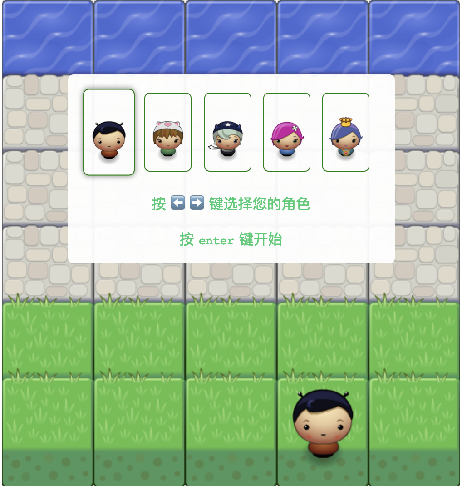
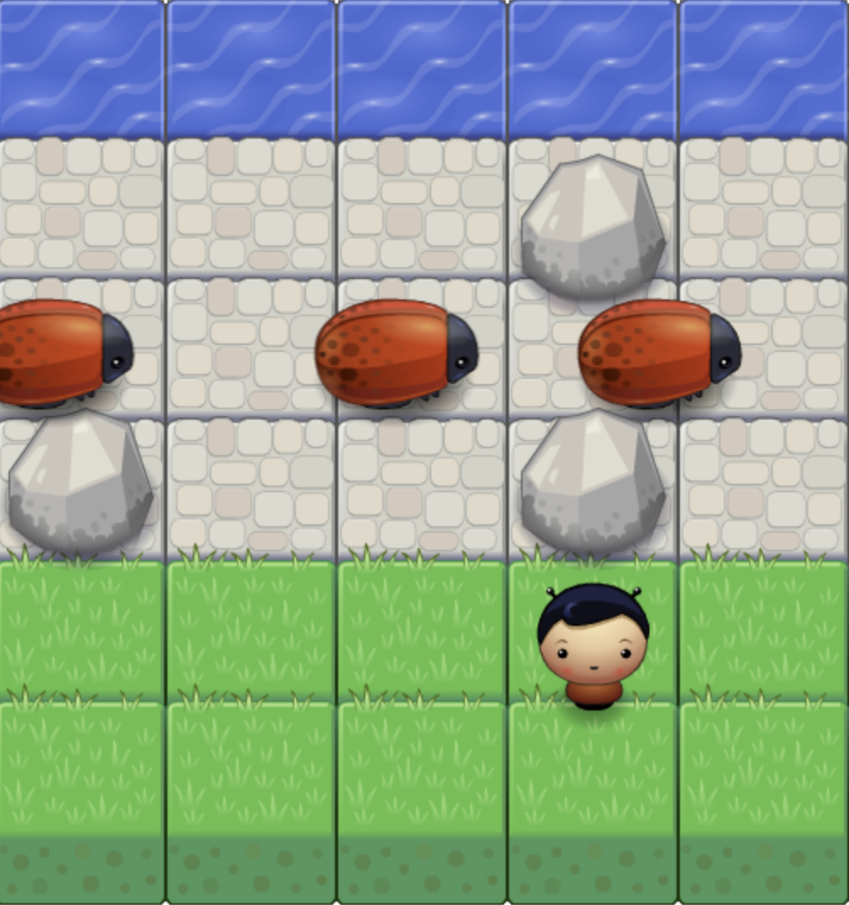
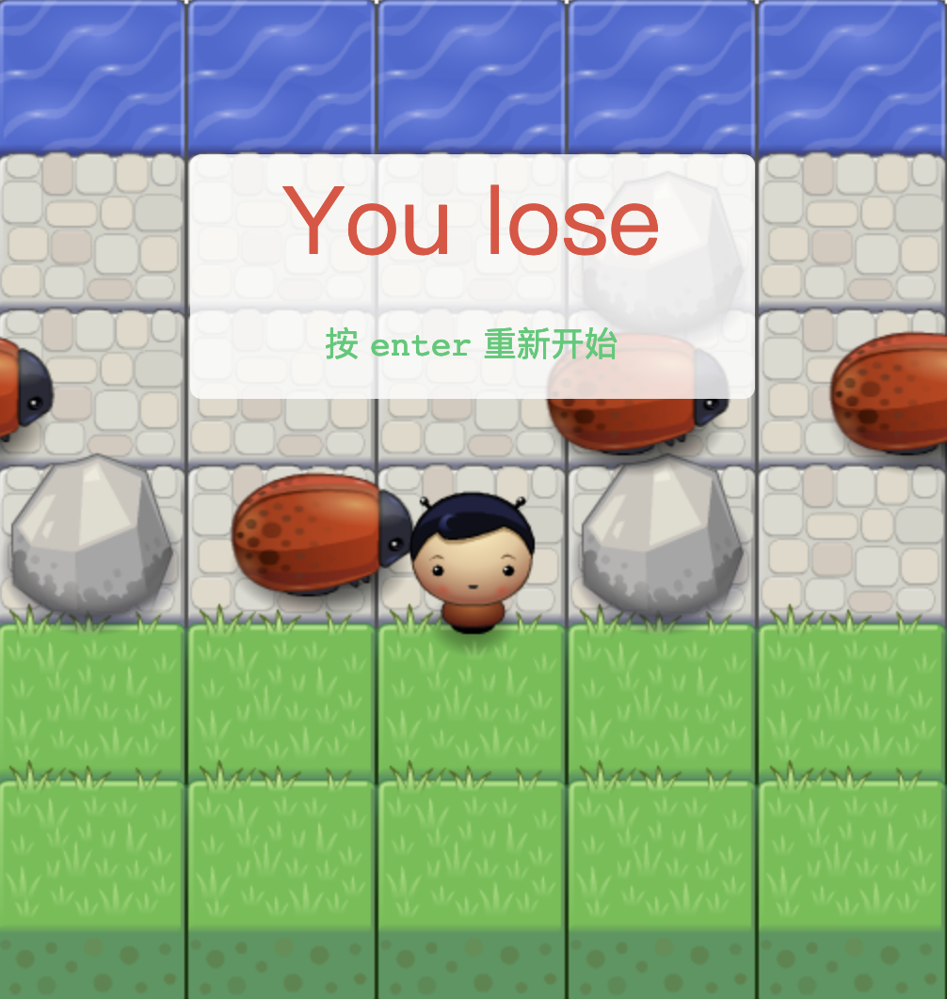
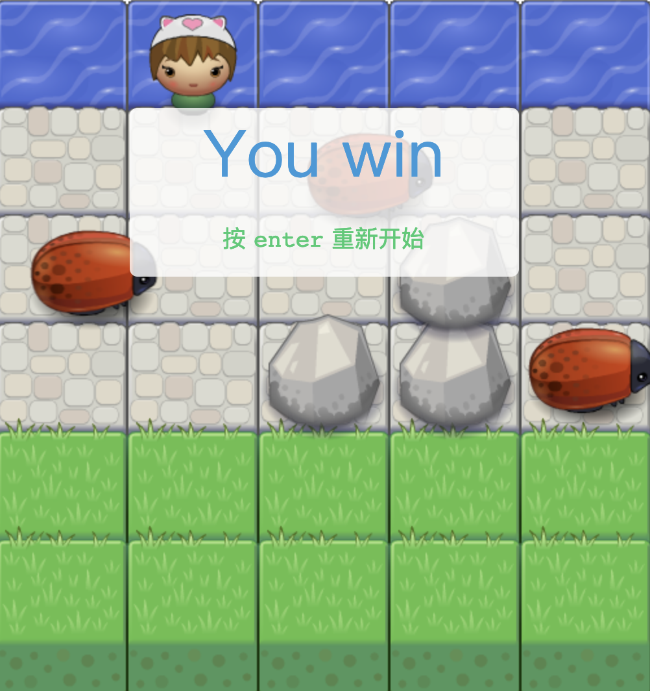

# Arcade Game Clone_zh

## 项目运行方法

1. 将项目下载到本地
2. 用浏览器打开index.html
3. 根据页面提示运行游戏即可

## 游戏玩法

* 根据游戏提示按左右键选人之后按enter键即可开始游戏
* 按上下左右键控制玩家的移动
* 玩家不可以移动到石头上
* 玩家碰到敌人后游戏失败
* 玩家到达河边后游戏成功
* 成功或失败之后根据提示按enter键即可重新进去选人页面开始新一轮的游戏

## 游戏截图

